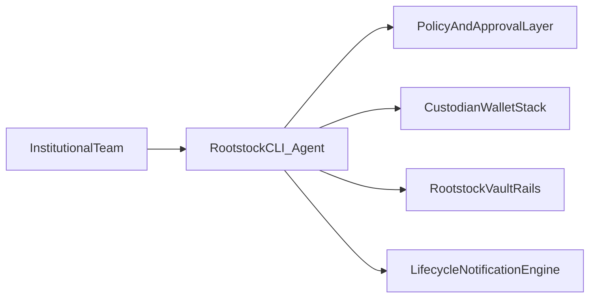

# Landing Copy - Rootstock Institutional CLI Agent

## Meta

- **Working title:** Rootstock Institutional CLI Agent
- **Primary CTA:** Book strategy call
- **Secondary CTA:** Request pilot scope
- **Audience:** Rootstock product, BD, and institutional growth stakeholders
- **Goal:** Secure next meeting to approve pilot

---

## Section 1 - Hero

### Eyebrow

Institutional funnel acceleration for Bitcoin DeFi

### Headline

Turn institutional interest into funded vault positions faster.

### Subheadline

A policy-aware CLI Agent that guides institutions from qualification to first BTC/USD vault allocation, then drives repeat deposits with proactive lifecycle workflows.

### Primary CTA

Book strategy call

### Secondary CTA

See pilot blueprint

### Hero proof line

Designed for measurable outcomes: lower onboarding friction, faster time-to-first-deposit, and stronger institutional AUM retention.

---

## Section 2 - The Current Gap

### Title

Why institutional leads stall before funding

### Copy

Institutional intent is strong, but the path to deployment is fragmented across compliance checks, custody workflows, bridge decisions, and allocation execution. Every handoff increases drop-off risk.

The result is not just slower onboarding. It is lost AUM expansion potential from teams that never reach first funded position.

### Bullets

- Multiple teams involved, no single guided workflow.
- High diligence load before first allocation.
- Unclear next steps after initial deposit.
- Revenue and AUM expansion delayed by operational friction.

---

## Section 3 - Solution Overview

### Title

A CLI Agent built for institutional conversion and lifecycle growth

### Copy

The Rootstock Institutional CLI Agent acts as a guided operating layer for institutional capital journeys. It combines conversational guidance, command-based actions, and policy-aware checkpoints to move users from intent to funded participation.

### Feature blocks

#### Onboard

Guide users through eligibility, policy constraints, and setup prerequisites.

#### Allocate

Provide structured flows for first BTC/USD vault allocation with role-aware confirmations.

#### Monitor

Deliver concise, auditable portfolio and vault status updates.

#### Rebalance

Support treasury adjustments based on allocation rules and thresholds.

#### Notify

Trigger contextual prompts for top-ups, re-deposits, and risk checks.

---

## Section 4 - Institutional Use Cases

### Title

What this enables in practice

### Use case 1

**Pre-deposit qualification**
The agent answers recurring diligence questions and routes teams to the exact next operational step.

### Use case 2

**Guided first allocation**
The agent converts "interested lead" into "first funded vault position" via a single guided workflow.

### Use case 3

**Post-deposit retention**
The agent keeps treasury teams active with policy-safe notifications and expansion opportunities.

### Use case 4

**Account-level operating rhythm**
The agent becomes the daily interface for institutional monitoring, action preparation, and allocation discipline.

---

## Section 5 - High-Level Architecture

### Title

Designed for institutional controls from day one

### Copy

The agent is framed as an orchestration layer on top of existing custody and policy processes, reducing operational complexity without bypassing governance controls.

### Diagram

### Footnote

Pilot implementation is phased and scoped around validated integrations and approved operational boundaries.

---

## Section 6 - Business Impact

### Title

KPIs tied to growth, not vanity metrics

### KPI cards

- Lead-to-qualified institutional conversion.
- Qualified-to-onboarded completion.
- Onboarded-to-first-funded allocation.
- First-to-second deposit conversion.
- Active institutional AUM retention and expansion.

### Supporting line

The pilot is designed to prove funnel impact quickly, then scale across broader institutional motion.

---

## Section 7 - Why This Is Credible

### Title

Built with an agent-first design mindset

### Copy

This concept combines two proven patterns:

- **Flow-first storytelling** inspired by agentic landing approaches.
- **Command-first operational design** inspired by mature AI-native CLI products.

Adapted specifically for institutional Bitcoin DeFi onboarding and treasury behavior.

---

## Section 8 - Pilot Offer

### Title

Start with a focused 4-6 week pilot

### Scope bullets

- Institutional funnel discovery and prioritization.
- CLI workflow design for onboarding and first allocation.
- Lifecycle notification strategy for re-deposit behavior.
- KPI instrumentation and reporting model.

### Deliverables bullets

- Working CLI demo flows.
- Funnel KPI dashboard definition.
- Pilot retrospective with rollout recommendation.

### CTA

Book strategy call

---

## Section 9 - FAQ (Commercial)

### Is this replacing current onboarding teams?

No. It augments existing BD, onboarding, and operations teams with a guided execution surface.

### Is this only for technical users?

No. The CLI layer can be paired with guided prompts and predefined flows tailored to each institutional role.

### Does this depend on immediate deep integration?

No. Pilot scope is phased to deliver value early while integration complexity is validated incrementally.

### Is this mainly a marketing page?

No. The landing is a commercial artifact to align stakeholders around a measurable pilot and next-step decision.

---

## Section 10 - Final CTA

### Headline

If Rootstock wants more institutional capital flowing into vault participation, the funnel needs an operator, not just documentation.

### Button

Book strategy call

### Supporting line

We will bring a pilot-ready CLI flow, KPI model, and implementation plan to the next meeting.
